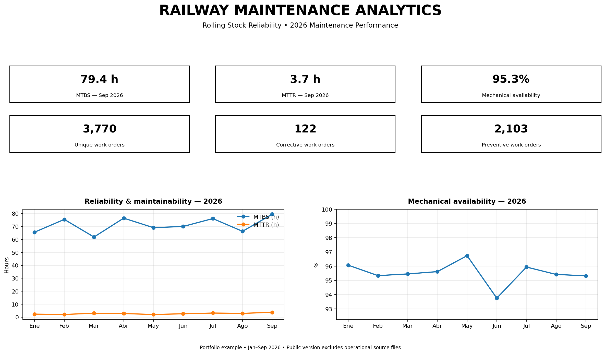

# Railway Maintenance Analytics | Rolling Stock Reliability

Professional portfolio project focused on **railway maintenance, reliability engineering and data analytics** for rolling stock.

## Project objective

Demonstrate how maintenance data can be transformed into decision-support information using reliability KPIs, work-order analysis and data visualization.

The project combines three complementary areas:

- **Railway Systems** — rolling stock, maintenance processes and fleet performance
- **Maintenance & Reliability Engineering** — MTBS, MTTR, availability and maintenance strategies
- **Data Analytics** — data preparation, KPI analysis, trends, comparisons and visualization

## KPIs

- MTBS — Mean Time Between Stops
- MTTR — Mean Time To Repair
- Mechanical availability
- Preventive vs. corrective maintenance
- Work-order volume by month and rolling-stock unit
- Reliability and maintenance trends

## Scope

- 14 rolling-stock units
- December 2025 – September 2026
- 3,770 unique work orders in the analyzed rolling-stock dataset
- 122 corrective work orders (CO)
- 2,103 preventive work orders (PV)

## Skills & Technical Approach

### Railway & Maintenance Engineering

- Rolling Stock Maintenance
- Railway Systems
- Preventive and Corrective Maintenance
- Maintenance Planning
- Reliability Engineering
- Fleet Performance Analysis
- CMMS / GMAO concepts

### Maintenance Analytics

- MTBS / MTBF concepts
- MTTR
- Mechanical Availability
- KPI development and monitoring
- Trend analysis
- Comparative analysis by rolling-stock unit
- Corrective vs. preventive maintenance analysis
- Data-driven maintenance decision support

### Data & Visualization

- Excel
- Python
- Data cleaning and preparation
- Aggregation and KPI calculation
- Data visualization
- Dashboard development
- Quality checks and analytical documentation

## Tools

**Excel · Python · Reliability Engineering · CMMS/GMAO · Data Analysis · Data Visualization · Railway Systems**

## Dashboard

### Dashboard Preview

The Excel dashboard provides:

1. Fleet-level KPI trend analysis
2. MTBS vs. MTTR
3. Mechanical availability trend
4. Corrective vs. preventive work orders
5. Rolling-stock unit performance
6. Methodology and data-quality notes

## Analytical approach

**Data → Cleaning → KPI → Trend → Finding → Maintenance decision**

The objective is not only to report indicators, but to identify deterioration, compare units, prioritize maintenance attention and support reliability improvement.

A typical workflow is:

1. Prepare and validate maintenance data
2. Standardize dates, assets and maintenance classifications
3. Calculate reliability and maintenance KPIs
4. Analyze trends and differences between units
5. Identify relevant maintenance patterns
6. Translate findings into maintenance actions or improvement opportunities

## Professional Focus

This portfolio is designed to demonstrate practical capabilities at the intersection of:

**Railway Systems + Maintenance Engineering + Reliability + Data Analytics**

It can be extended with Python-based analysis, Pareto analysis, failure-mode analysis, root-cause analysis and interactive BI dashboards.

## Confidentiality

This repository is intended as a **public professional portfolio**. Operational source files, detailed work-order records, internal system information, company-specific identifiers, internal network paths, suppliers and confidential procedures are not included.

The published portfolio focuses on analytical methods, aggregated indicators and professional capabilities rather than confidential operational information.

## Author

**Miguel Cárdenas**  
Railway Systems · Rolling Stock Maintenance · Reliability Engineering · Data Analytics
